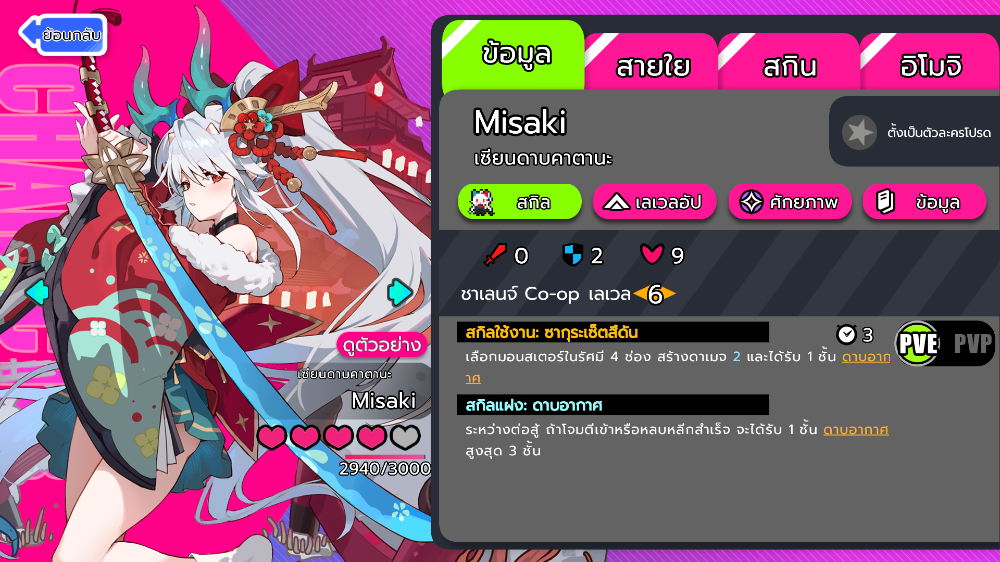
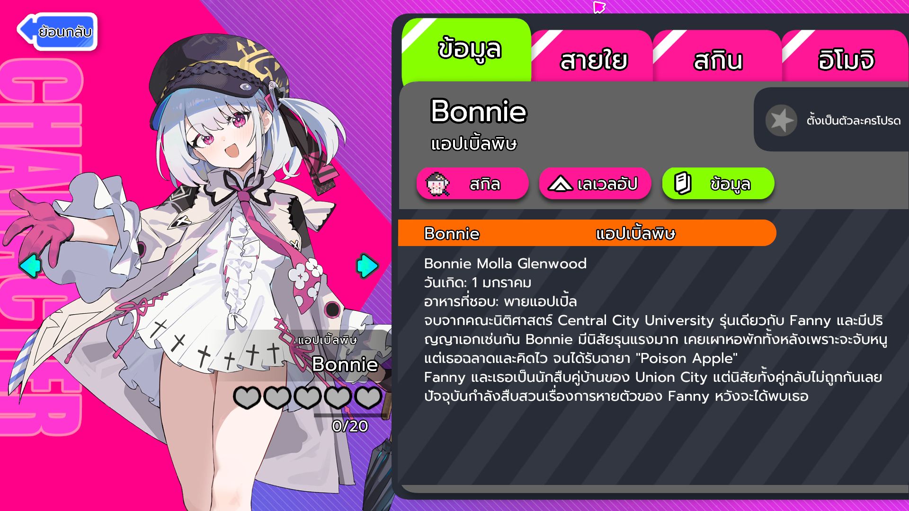
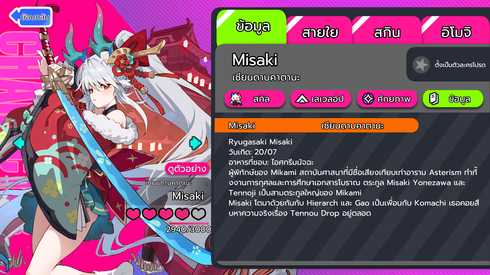
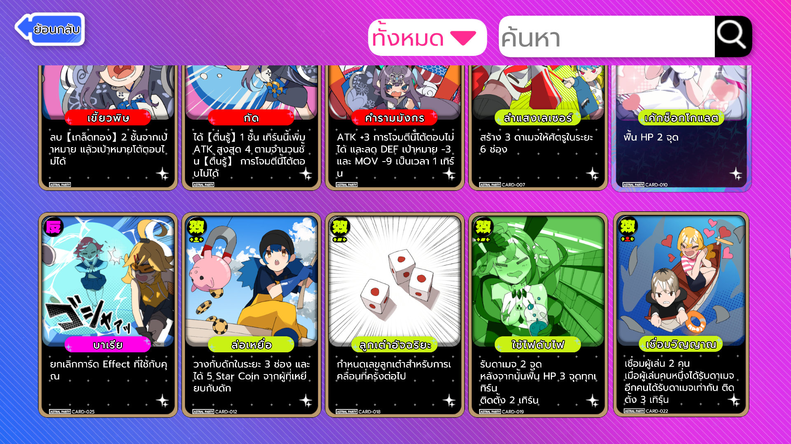
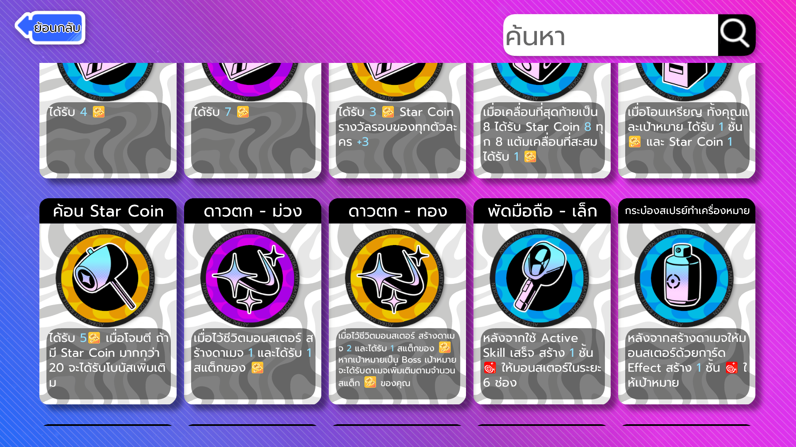
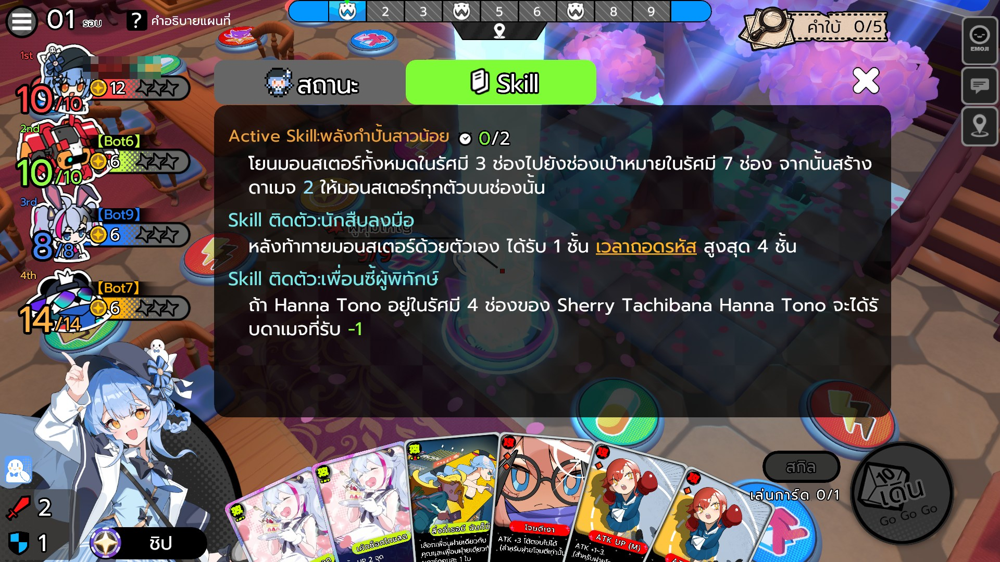
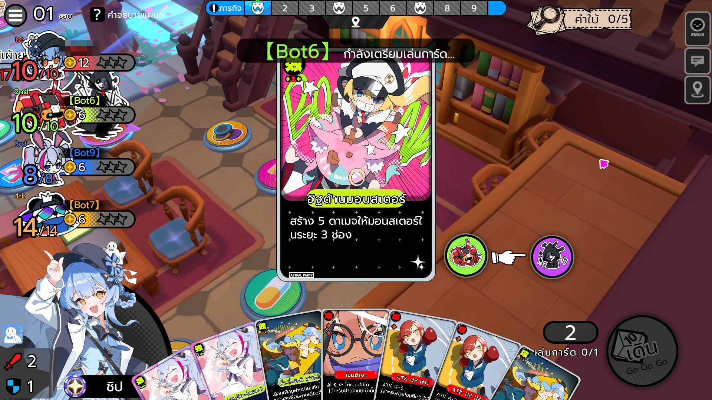

<p align="center">
  
</p>

<h1 align="center">Astral Party Thai Mod</h1>

<p align="center">
  <strong>ม็อดแปลภาษาไทยสำหรับ Astral Party (星穹派对)</strong>
</p>

<p align="center">
  รองรับเวอร์ชั่น <strong>V3.2.0</strong> hot patch (INT) · Mod v1.3.2
</p>

<p align="center">
  <a href="https://github.com/runarissu/Astral-Party-Thai-Mod/graphs/traffic"></a>
  
  
</p>

---

## ตัวอย่างภาพในเกม

<table>
  <tr>
    <td></td>
    <td></td>
  </tr>
  <tr>
    <td></td>
    <td></td>
  </tr>
  <tr>
    <td></td>
    <td></td>
  </tr>
  <tr>
    <td></td>
    <td></td>
  </tr>
</table>

---

## วิธีติดตั้ง

### ข้อกำหนด

- ติดตั้ง **Astral Party** บน Steam (เวอร์ชั่น INT)
- เคยเปิดเกมอย่างน้อย 1 ครั้ง
- Windows 10/11

### ขั้นตอนการติดตั้ง

1. ดาวน์โหลด ZIP จากหน้า [Releases](../../releases)
2. แตกไฟล์ ZIP ไปยังโฟลเดอร์ใดก็ได้
3. คลิกขวา `install.bat` → เลือก **"Run as administrator"**
4. กด **Yes** เมื่อ Windows ถาม UAC (User Account Control)
5. รอจนกว่าจะเห็นข้อความ **"Installation Complete!"** บนหน้าจอ
6. ปิดหน้าต่าง installer แล้วเปิดเกมได้เลย

> **หมายเหตุ**: หากติดตั้งม็อดเวอร์ชั่นเก่าแล้ว สามารถติดตั้งทับได้เลย installer จะสำรองไฟล์เดิมเป็น `.original_font` และ `.original.bak` อัตโนมัติ

### ขั้นตอนที่ installer ทำอัตโนมัติ

| Step | งาน | รายละเอียด |
|------|-----|-----------|
| 1/6 | ตรวจสอบเกม | เช็คว่าเกมติดตั้งแล้วและมี cache อยู่ |
| 2/6 | ติดตั้งฟอนต์ | ติดตั้ง `Prompt-Regular.ttf` ลง Windows Fonts |
| 3/6 | ติดตั้งคำแปล | คัดลอก `clean_thai.tsv` ไปยัง LocalLow |
| 4/6 | ติดตั้ง DLL + Localization | แพตช์ DLL bundle (font redirect + cache) และ Thai XML |
| 5/6 | Inject Thai fonts ใน cache | แทนที่ CDN-delivered font bundles ด้วย Thai clones |
| 6/6 | ติดตั้ง TMP font bundles | วาง Thai TMP fonts ใน StreamingAssets |

## มีอะไรใหม่ใน v1.3.2

- **แก้คำแปล UI ใน XML** — แก้คำแปล FairyGUI 14 จุด เช่น PVP→แมตช์, PVE→รีเพลย์, แพ็คกิ้ฟต์พิเศษ→แพ็กของขวัญบูสต์
- **แก้วรรคตา fullwidth→halfwidth** — แทนที่วงเล็บและโคลอนแบบ fullwidth (（）：) ด้วย halfwidth (():) ในหลายจุด
- **แก้คำแปล STR** — แก้ "เมาส์เต้นตึ๊ด" → "หนูเต้นตึ๊ด" ใน str_batch_03

## มีอะไรใหม่ใน v1.3.1

- **ปรับปรุงคำแปลทั้งหมด** — รีวิวและแก้คำแปลใน STR batch ทั้ง 39 ไฟล์ (7,723 entries) เน้นความเป็นธรรมชาติ ความหมายตรงกับต้นฉบับ และบริบทเกม
- **ซ่อมคำแปลที่ผิดบริบท** — แก้คำแปลที่ผิดความหมายหรือไม่เป็นธรรมชาติในหลายจุด เช่น บทช่วยสอน คำอธิบายมอนสเตอร์ และคำอธิบายเอฟเฟกต์
- **ซ่อมความสม่ำเสมอของคำศัพท์** — ปรับคำศัพท์ให้ตรงกับ glossary เช่น แพ็ก, เช็กอิน, ความผูกพัน, Star Coin/Star Disc, เอฟเฟกต์
- **คงจำนวน entries เท่าเดิม** — 7,723 entries เท่ากับ v1.3.0 ไม่มีคอนเทนต์ใหม่จากเกม

## มีอะไรใหม่ใน v1.3.0

- **รองรับเกมอัปเดต 2026-09-07** — เกมปรับ balance มอนสเตอร์ (Jelly Wizard 1 → 2 ตัวใน STRMapEvent)
- **อัปเดต DLL cache path ใหม่** — เกมเปลี่ยน hotupdate DLL cache path จาก 2 paths เป็น 1 path ใหม่
- **Installer ใช้ dynamic cache paths** — อ่านจาก manifest แทน hardcoded paths รองรับ game update ในอนาคต
- **คำแปลเดิมครบทั้งหมด** — 7,724 entries เท่าเดิม แก้เฉพาะ 2 entries ที่เกมเปลี่ยน

## มีอะไรใหม่ใน v1.2.0

- **รองรับเกม V3.2.0 hot patch** — อัปเดตตามเกมที่เปลี่ยน DLL (GetLocal count 61 → 63) และฟอนต์ผ่าน CDN
- **แปลเพิ่ม 60+ entry ใหม่** — ระบบ Guild, แผนที่ใหม่ (Heatwave Shores), Relic ใหม่
- **แปล XML strings เพิ่ม 57 รายการ** — ครอบคลุม UI และข้อความระบบใหม่
- **Glossary อัปเดต 110 คำ** — เพิ่มคำศัพท์ใหม่และปรับความสม่ำเสมอ
- **CDN font injection** — รองรับการโหลดฟอนต์ผ่าน CDN ของเกมใหม่ (TMP font cache replacement)
- **ปรับปรุงความสม่ำเสมอ** — ทบทวนคำแปลทั้ง 7,724 รายการ ปรับ trait descriptions 70 รายการ และ voice lines 33 ตัวละคร

## วิธีการทำงาน

ม็อดนี้แก้ไข 4 ระบบหลัก:

**Font Redirection** — font names ที่ลงท้ายด้วย `_TMP` คงไว้โหลด Thai TMP bundle ผ่าน Addressables ส่วน font names อื่น redirect ไป `"Prompt"` (OS font) เพื่อสร้าง DynamicFont ผ่าน `Font.CreateDynamicFontFromOSFont`

**TMP Font Bundles** — clone Unity-built Static TMP_FontAsset (family Prompt) ออกเป็น 13 bundles สำหรับ fonts ของเกม แต่ละ bundle มี pre-baked SDF atlas + glyph-pair adjustments

**Pair Adjustments** — embed pair adjustment records เป็น static arrays ในทั้ง TMPFont และ DynamicFont ใช้ char-based linear search ปรับตำแหน่งวรรณยุกต์/สระลอยให้ถูกต้อง

**Translation Cache** — แพตช์เมธอด `GetLocal()` ทั้ง 63 ตัว ให้อ่านคำแปลจาก `clean_thai.tsv` ผ่าน cache แบบ pre-parsed

## วิธีถอนการติดตั้ง

1. **ลบ font**: Control Panel → Fonts → `Prompt Regular` → Delete
2. **กู้คืนไฟล์เกม**: Steam → คลิกขวาเกม → Properties → Local Files → Verify integrity of game files
3. **ลบ cache ม็อด** (ถ้ามี): ลบโฟลเดอร์ `AppData\LocalLow\feimo\AstralParty_INT\com.unity.addressables\AssetBundles` แล้วเปิดเกมใหม่เพื่อดาวน์โหลด cache ใหม่จากเซิร์ฟเวอร์

## โครงสร้างไฟล์ใน Release

```
├── install.bat              # One-click installer (Run as admin)
├── install.ps1              # Installer script (v1.3.2)
├── fonts/
│   └── Prompt-Regular.ttf   # Thai font (OS font for DynamicFont)
├── data/
│   └── clean_thai.tsv       # Translation table (7,723 entries)
└── bundles/
    ├── hotupdate_dll/       # Patched DLL (font redirect + cache + pair adjustments)
    ├── localization/        # Thai localization bundle (XML)
    ├── font_cache/          # Thai font cache replacements (CDN injection)
    └── tmp_fonts/           # 13 Thai TMP font bundles
```

## Known Issues

- **ภาษาไทยบางจุดยังมีสระและวรรณยุกต์ซ้อน**
- **แปลทั้งหมดด้วย AI ถึงจะเกลามาหลายรอบแล้ว แต่ก็ยังพบจุดที่แปลกๆ อยู่**
- **ฟอนต์ไทยบางจุดแสดงผลไม่ชัดและตัวเล็ก**

พบปัญหา? รายงานได้ที่ [Issues](../../issues) พร้อมแนบภาพหน้าจอ

## Disclaimer

ม็อดนี้ไม่ได้เกี่ยวข้องกับผู้พัฒนาเกม ไม่ได้แจกจ่ายไฟล์เกมที่มีลิขสิทธิ์ ใช้ความเสี่ยงของผู้ใช้เอง หากเกมอัปเดต ม็อดอาจต้องได้รับการอัปเดตตาม

## License

[MIT](LICENSE)
